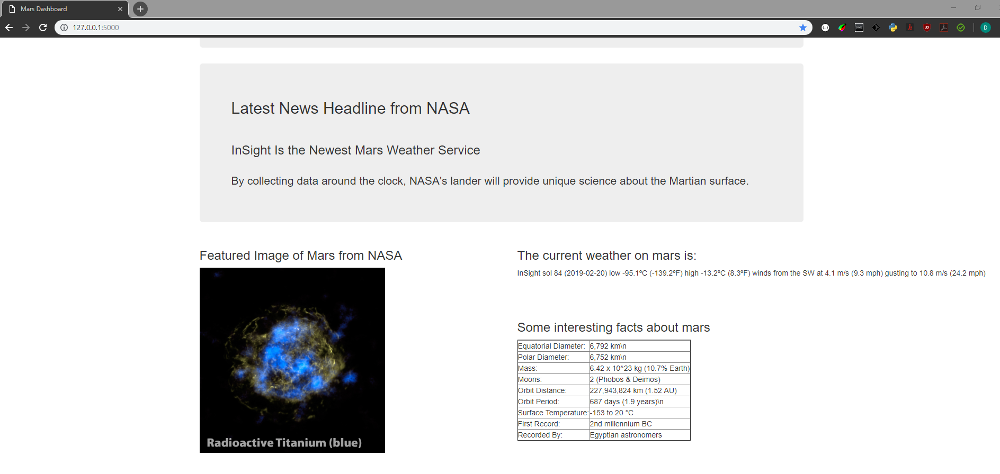
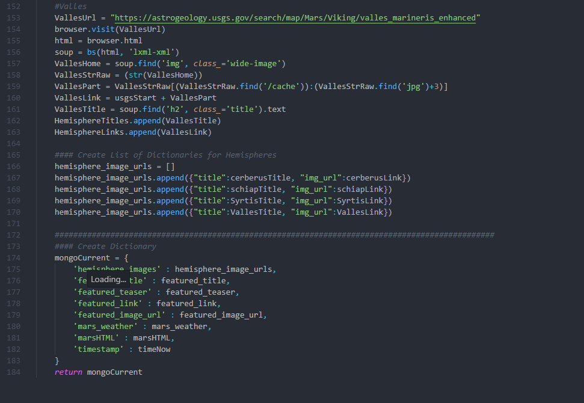
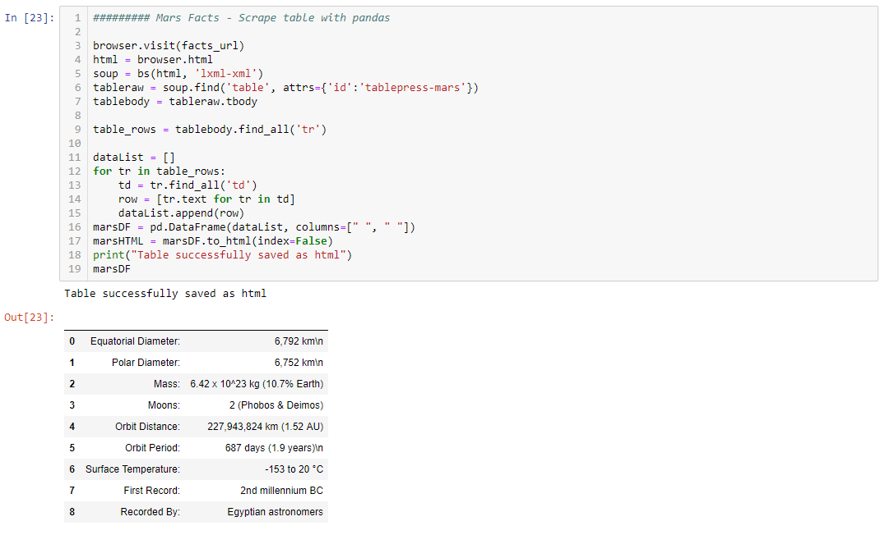

# Mars Weather Dashboard

## Website with a single purpose - scrape NASA websites for current conditions on MARS!

#### Application includes:
* Jupyter Notebook for all proof of concept work and code development
* Scrape_NASA.py that combines 'all' of the scraping functions from ipynb
* Scrape_Mars.py is a Flask App, renders an HTML template with a single button (Scrape_Nasa.py)
* Info is temporarily stored in a MongoDB Dictionary before being rendered in the Flask App

#### What's info is being displayed?
* Mars Weather
* Most recent NASA tweet of mars weather
* NASA's current featured image from the Mars website
* Current images of Mar's moons

